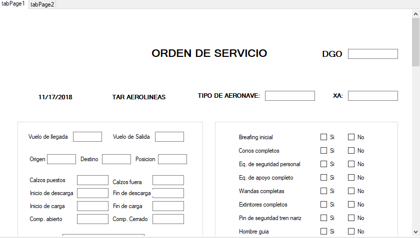
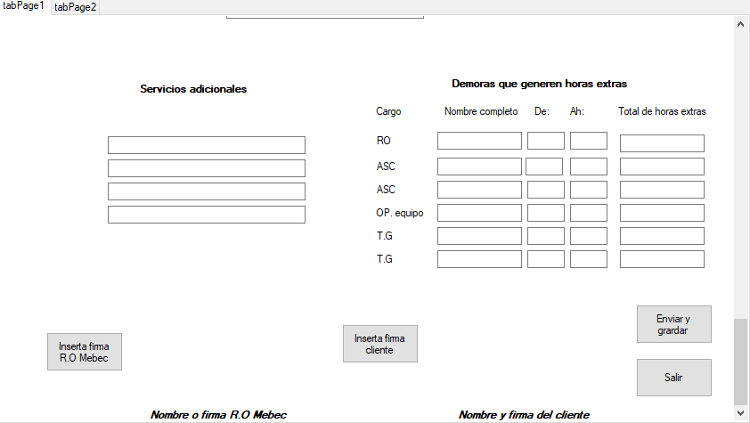

# Programa de captura
Programa realizado con el lenguaje de c# el cual tiene como finalidad hacer sistematica la captura de datos de una orden de serbvicio.

# Caracteristicas
Cuanta con la opcion de insertar una firma electronica y esta diseñada para poder conectarse a base de datos o imprimir en PDF mediante una extencion.

